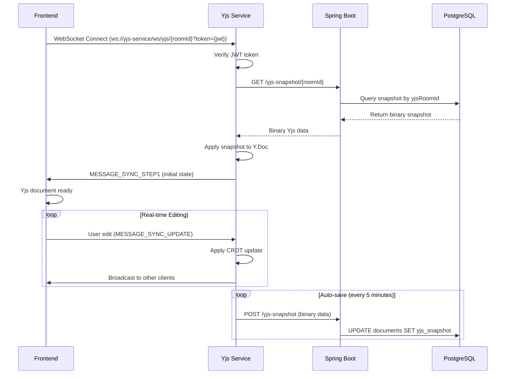

# Collab-Docs API Contract

**Version:** 1.0  
**Base URL:** `http://localhost:8080`  
**Authentication:** JWT (HttpOnly Cookie)

---

## Table of Contents

1. [Authentication](#authentication)
2. [Document Management](#document-management)
3. [Error Responses](#error-responses)
4. [Common Headers](#common-headers)

---

## Authentication

All authentication endpoints are publicly accessible. After successful login, a JWT token is set as an HttpOnly cookie.

### 1. Register User

**Endpoint:** `POST /api/auth/register`  
**Description:** Initiate user registration. Sends OTP to email for verification.  
**Authentication:** None

**Request Body:**
```json
{
  "firstName": "string, required, max 50 chars",
  "lastName": "string, required, max 50 chars",
  "email": "string, required, valid email",
  "password": "string, required, 8-120 chars"
}
```

**cURL Example:**
```bash
curl -X POST http://localhost:8080/api/auth/register \
  -H "Content-Type: application/json" \
  -d '{
    "firstName": "John",
    "lastName": "Doe",
    "email": "john.doe@example.com",
    "password": "SecurePass123!"
  }'
```

**Success Response (200 OK):**
```json
{
  "message": "Registration initiated successfully! Please check your email for the verification code."
}
```

---

### 2. Verify OTP

**Endpoint:** `POST /api/auth/verify-otp`  
**Description:** Complete registration by verifying OTP sent to email.  
**Authentication:** None

**Request Body:**
```json
{
  "email": "string, required",
  "otp": "string, required, 6 digits"
}
```

**cURL Example:**
```bash
curl -X POST http://localhost:8080/api/auth/verify-otp \
  -H "Content-Type: application/json" \
  -c cookies.txt \
  -d '{
    "email": "john.doe@example.com",
    "otp": "123456"
  }'
```

**Success Response (200 OK):**
```json
{
  "message": "Email verified successfully! Your account has been created. You can now login."
}
```

---

### 3. Resend OTP

**Endpoint:** `POST /api/auth/resend-otp`  
**Description:** Resend verification OTP to email.  
**Authentication:** None

**Request Body:**
```json
{
  "email": "string, required"
}
```

**cURL Example:**
```bash
curl -X POST http://localhost:8080/api/auth/resend-otp \
  -H "Content-Type: application/json" \
  -d '{
    "email": "john.doe@example.com"
  }'
```

**Success Response (200 OK):**
```json
{
  "message": "Verification code has been resent to your email."
}
```

---

### 4. Login

**Endpoint:** `POST /api/auth/login`  
**Description:** Authenticate user and receive JWT token in HttpOnly cookie.  
**Authentication:** None

**Request Body:**
```json
{
  "email": "string, required",
  "password": "string, required"
}
```

**cURL Example:**
```bash
curl -X POST http://localhost:8080/api/auth/login \
  -H "Content-Type: application/json" \
  -c cookies.txt \
  -d '{
    "email": "john.doe@example.com",
    "password": "SecurePass123!"
  }'
```

**Success Response (200 OK):**
```json
{
  "id": 1,
  "email": "john.doe@example.com",
  "firstName": "John",
  "lastName": "Doe",
  "message": "Login successful. JWT Token is added to cookies."
}
```

---

### 5. Forgot Password

**Endpoint:** `POST /api/auth/forgot-password`  
**Description:** Request password reset OTP. Sends OTP to email.  
**Authentication:** None

**Request Body:**
```json
{
  "email": "string, required"
}
```

**cURL Example:**
```bash
curl -X POST http://localhost:8080/api/auth/forgot-password \
  -H "Content-Type: application/json" \
  -d '{
    "email": "john.doe@example.com"
  }'
```

**Success Response (200 OK):**
```json
{
  "message": "Password reset code has been sent to your email."
}
```

---

### 6. Reset Password

**Endpoint:** `POST /api/auth/reset-password`  
**Description:** Reset password using OTP received via email.  
**Authentication:** None

**Request Body:**
```json
{
  "email": "string, required",
  "otp": "string, required, 6 digits",
  "newPassword": "string, required, 8-120 chars"
}
```

**cURL Example:**
```bash
curl -X POST http://localhost:8080/api/auth/reset-password \
  -H "Content-Type: application/json" \
  -d '{
    "email": "john.doe@example.com",
    "otp": "654321",
    "newPassword": "NewSecurePass123!"
  }'
```

**Success Response (200 OK):**
```json
{
  "message": "Password has been reset successfully. You can now login with your new password."
}
```

---

### 7. Logout

**Endpoint:** `POST /api/auth/logout`  
**Description:** Logout user by clearing JWT cookie.  
**Authentication:** Required (JWT)

**cURL Example:**
```bash
curl -X POST http://localhost:8080/api/auth/logout \
  -b cookies.txt \
  -c cookies.txt
```

**Success Response (200 OK):**
```json
{
  "message": "Logged out successfully"
}
```

---

### 8. Get Current User

**Endpoint:** `GET /api/auth/me`  
**Description:** Get currently authenticated user's information.  
**Authentication:** Required (JWT)

**cURL Example:**
```bash
curl -X GET http://localhost:8080/api/auth/me \
  -b cookies.txt
```

**Success Response (200 OK):**
```json
{
  "id": 1,
  "email": "john.doe@example.com",
  "firstName": "John",
  "lastName": "Doe",
  "message": "User details retrieved successfully"
}
```

---

### 9. Refresh Token

**Endpoint:** `POST /api/auth/refresh`  
**Description:** Refresh JWT token. Returns new token in HttpOnly cookie.  
**Authentication:** Required (JWT)

**cURL Example:**
```bash
curl -X POST http://localhost:8080/api/auth/refresh \
  -b cookies.txt \
  -c cookies.txt
```

**Success Response (200 OK):**
```json
{
  "message": "Token refreshed successfully"
}
```

---

### 10. Validate Token

**Endpoint:** `POST /api/auth/validate`  
**Description:** Validate if current JWT token is valid.  
**Authentication:** Required (JWT)

**cURL Example:**
```bash
curl -X POST http://localhost:8080/api/auth/validate \
  -b cookies.txt
```

**Success Response (200 OK):**
```json
{
  "valid": true,
  "email": "john.doe@example.com",
  "message": "Token is valid"
}
```

---

## Document Management

All document endpoints require authentication.

### 1. Get Document

**Endpoint:** `GET /api/documents`  
**Description:** Get a specific document by ID.  
**Authentication:** Required (JWT)

**Query Parameters:**
- `document_id` (required): Long - Document ID

**cURL Example:**
```bash
curl -X GET "http://localhost:8080/api/documents?document_id=1" \
  -b cookies.txt
```

**Success Response (200 OK):**
```json
{
  "id": 1,
  "title": "My Document",
  "fileName": "My Document.docx",
  "contentType": "text/html",
  "content": "<div><p>Document content...</p></div>",
  "fileSize": 1024,
  "yjsRoomId": "doc_abc123def456",
  "ownerEmail": "john.doe@example.com",
  "ownerName": "John Doe",
  "isTemplate": false,
  "visibility": "PRIVATE",
  "isDeleted": false,
  "createdAt": "2026-02-09T10:00:00",
  "updatedAt": "2026-02-09T12:00:00"
}
```

---

### 2. Get User Documents

**Endpoint:** `GET /api/documents/user/documents`  
**Description:** Get paginated list of documents owned by authenticated user.  
**Authentication:** Required (JWT)

**Query Parameters:**
- `page` (optional, default: 0): int - Page number (0-indexed)
- `size` (optional, default: 20): int - Page size (1-100)

**cURL Example:**
```bash
curl -X GET "http://localhost:8080/api/documents/user/documents?page=0&size=20" \
  -b cookies.txt
```

**Success Response (200 OK):**
```json
{
  "content": [
    {
      "id": 1,
      "title": "Document 1",
      "fileName": "doc1.docx",
      "contentType": "text/html",
      "fileSize": 2048,
      "yjsRoomId": "doc_xyz789",
      "ownerEmail": "john.doe@example.com",
      "ownerName": "John Doe",
      "isTemplate": false,
      "visibility": "PRIVATE",
      "isDeleted": false,
      "createdAt": "2026-02-09T10:00:00",
      "updatedAt": "2026-02-09T12:00:00"
    }
  ],
  "pageable": {
    "pageNumber": 0,
    "pageSize": 20
  },
  "totalElements": 5,
  "totalPages": 1,
  "last": true,
  "first": true,
  "size": 20,
  "number": 0,
  "numberOfElements": 5,
  "empty": false
}
```

---

### 3. Create Blank Document

**Endpoint:** `POST /api/documents/create`  
**Description:** Create a new blank HTML document.  
**Authentication:** Required (JWT)

**Request Body:**
```json
{
  "title": "string, optional, defaults to 'Untitled Document'"
}
```

**cURL Example:**
```bash
curl -X POST http://localhost:8080/api/documents/create \
  -H "Content-Type: application/json" \
  -b cookies.txt \
  -d '{
    "title": "My New Document"
  }'
```

**Success Response (201 CREATED):**
```json
{
  "id": 2,
  "title": "My New Document",
  "fileName": "My New Document.docx",
  "contentType": "text/html",
  "fileSize": 0,
  "yjsRoomId": "doc_newroom123",
  "ownerEmail": "john.doe@example.com",
  "ownerName": "John Doe",
  "isTemplate": false,
  "visibility": "PRIVATE",
  "isDeleted": false,
  "createdAt": "2026-02-09T15:00:00",
  "updatedAt": "2026-02-09T15:00:00"
}
```

---

### 4. Upload Document

**Endpoint:** `POST /api/documents/upload`  
**Description:** Upload DOCX or PDF file. Content is extracted and converted to HTML.  
**Authentication:** Required (JWT)  
**Content-Type:** `multipart/form-data`

**Form Parameters:**
- `file` (required): File - DOCX or PDF file (max 20MB)
- `title` (optional): String - Document title (defaults to filename)

**cURL Example:**
```bash
curl -X POST http://localhost:8080/api/documents/upload \
  -b cookies.txt \
  -F "file=@/path/to/document.docx" \
  -F "title=Uploaded Document"
```

**Success Response (201 CREATED):**
```json
{
  "id": 3,
  "title": "Uploaded Document",
  "fileName": "document.docx",
  "contentType": "text/html",
  "fileSize": 15360,
  "yjsRoomId": "doc_upload456",
  "ownerEmail": "john.doe@example.com",
  "ownerName": "John Doe",
  "isTemplate": false,
  "visibility": "PRIVATE",
  "isDeleted": false,
  "createdAt": "2026-02-09T15:30:00",
  "updatedAt": "2026-02-09T15:30:00"
}
```

---

### 5. Update Document Visibility

**Endpoint:** `PUT /api/documents/{documentId}/visibility`  
**Description:** Change document visibility (PRIVATE, SHARED, PUBLIC). Only document owner can update.  
**Authentication:** Required (JWT)

**Path Parameters:**
- `documentId` (required): Long - Document ID

**Request Body:**
```json
{
  "visibility": "string, required, enum: PRIVATE|SHARED|PUBLIC"
}
```

**cURL Example:**
```bash
curl -X PUT http://localhost:8080/api/documents/1/visibility \
  -H "Content-Type: application/json" \
  -b cookies.txt \
  -d '{
    "visibility": "SHARED"
  }'
```

**Success Response (200 OK):**
```json
{
  "message": "Document visibility updated successfully"
}
```

---

### 6. Delete Document

**Endpoint:** `DELETE /api/documents/{documentId}`  
**Description:** Soft delete a document. Only document owner can delete.  
**Authentication:** Required (JWT)

**Path Parameters:**
- `documentId` (required): Long - Document ID

**cURL Example:**
```bash
curl -X DELETE http://localhost:8080/api/documents/1 \
  -b cookies.txt
```

**Success Response (200 OK):**
```json
{
  "message": "Document deleted successfully"
}
```

---

### 7. Save Yjs Snapshot (Internal)

**Endpoint:** `POST /api/documents/yjs-snapshot`  
**Description:** Save Yjs CRDT snapshot to database. Called by Node.js yjs-service.  
**Authentication:** None (internal service-to-service call)  
**Content-Type:** `application/octet-stream`

**Query Parameters:**
- `yjsRoomId` (required): String - Yjs room ID from document

**Request Body:**
- Binary Yjs snapshot data (byte array)

**cURL Example:**
```bash
# Save binary snapshot to PostgreSQL
curl -X POST "http://localhost:8080/api/documents/yjs-snapshot?yjsRoomId=doc_abc123" \
  -H "Content-Type: application/octet-stream" \
  --data-binary "@snapshot.bin"
```

**Success Response (200 OK):**
```json
{
  "message": "Yjs snapshot saved successfully!"
}
```

**Error Response (500 Internal Server Error):**
```json
{
  "message": "Error: Failed to save Yjs snapshot!"
}
```

---

### 8. Get Yjs Snapshot (Internal)

**Endpoint:** `GET /api/documents/yjs-snapshot/{yjsRoomId}`  
**Description:** Get Yjs CRDT snapshot from database. Called by Node.js yjs-service for document recovery.  
**Authentication:** None (internal service-to-service call)

**Path Parameters:**
- `yjsRoomId` (required): String - Yjs room ID from document

**cURL Example:**
```bash
# Retrieve binary snapshot from PostgreSQL
curl -X GET http://localhost:8080/api/documents/yjs-snapshot/doc_abc123 \
  -o snapshot.bin
```

**Success Response (200 OK):**
- **Content-Type:** `application/octet-stream`
- **Body:** Binary Yjs snapshot data (Uint8Array)

**Empty Snapshot Response (204 No Content):**
- Returned when document exists but has no snapshot yet (new document)
- Empty body

**Error Response (404 Not Found):**
```json
{
  "message": "Error: Document not found or has been deleted for room ID: doc_abc123"
}
```

**Error Response (500 Internal Server Error):**
```json
{
  "message": "Error: Failed to retrieve snapshot!"
}
```

---

## Error Responses

All error responses follow this format:

**400 Bad Request:**
```json
{
  "message": "Error: Validation failed / Invalid input"
}
```

**401 Unauthorized:**
```json
{
  "message": "Error: Unauthorized. Please login."
}
```

**403 Forbidden:**
```json
{
  "message": "Error: Access denied. You don't have permission to access this resource."
}
```

**404 Not Found:**
```json
{
  "message": "Error: Resource not found"
}
```

**500 Internal Server Error:**
```json
{
  "message": "Error: Internal server error"
}
```

### Validation Errors

**422 Unprocessable Entity:**
```json
{
  "message": "Validation error: [field: error message]"
}
```

Example:
```json
{
  "message": "Validation error: [password: Password must be between 8 and 120 characters]"
}
```

---

## Common Headers

### Request Headers

**Required for JSON requests:**
```
Content-Type: application/json
```

**Required for file uploads:**
```
Content-Type: multipart/form-data
```

**Required for authenticated endpoints:**
```
Cookie: JWT=<token>
```

### Response Headers

**Successful login/refresh:**
```
Set-Cookie: JWT=<token>; Path=/; HttpOnly; Max-Age=86400
```

---

## Authentication Flow

### Complete Registration & Login Flow

```bash
# 1. Register
curl -X POST http://localhost:8080/api/auth/register \
  -H "Content-Type: application/json" \
  -d '{"firstName":"John","lastName":"Doe","email":"john@example.com","password":"Pass123!"}'

# 2. Check email for OTP (6-digit code)

# 3. Verify OTP
curl -X POST http://localhost:8080/api/auth/verify-otp \
  -H "Content-Type: application/json" \
  -c cookies.txt \
  -d '{"email":"john@example.com","otp":"123456"}'

# 4. Login
curl -X POST http://localhost:8080/api/auth/login \
  -H "Content-Type: application/json" \
  -c cookies.txt \
  -d '{"email":"john@example.com","password":"Pass123!"}'

# 5. Use authenticated endpoints
curl -X GET http://localhost:8080/api/auth/me -b cookies.txt
curl -X POST http://localhost:8080/api/documents/create \
  -H "Content-Type: application/json" \
  -b cookies.txt \
  -d '{"title":"My Document"}'
```

---

## Document Visibility Levels

| Level | Description | Access |
|-------|-------------|--------|
| `PRIVATE` | Only owner can access | Owner only |
| `SHARED` | Collaborators can access | Owner + Collaborators |
| `PUBLIC` | Anyone can access | Everyone |

> **Note:** SHARED and PUBLIC access are not fully implemented yet. Currently, only owner can access documents.

---

## Rate Limits

- **OTP Requests:** Maximum 5 per hour per email
- **OTP Attempts:** Maximum 3 attempts before 30-minute block
- **File Upload:** Maximum 20MB per file

---

## Supported File Types

**Upload endpoint accepts:**
- `.docx` - Microsoft Word (OpenXML)
- `.pdf` - PDF documents

All uploaded files are converted to HTML and stored in the database.

---

## Environment Configuration

Default configuration:

```properties
# Server
server.port=8080

# Database
spring.datasource.url=jdbc:postgresql://localhost:5432/collab_docs
spring.datasource.username=postgres
spring.datasource.password=postgres

# JWT
jwt.secret=your-secret-key-min-32-chars
jwt.expiration.ms=86400000  # 24 hours

# Email (Gmail)
spring.mail.username=your-email@gmail.com
spring.mail.password=your-app-password

# OTP
otp.expiry.minutes=10
otp.max.attempts=3
otp.block.minutes=30
```

See `.env.example` for Docker environment variables.

---

## Real-Time Collaboration (WebSocket)

The Node.js Yjs service provides real-time collaborative editing via WebSocket using the Yjs CRDT protocol.

### WebSocket Connection

**Endpoint:** `ws://localhost:3000/ws/yjs/{yjsRoomId}`  
**Protocol:** Yjs sync protocol (y-protocols)  
**Authentication:** JWT token (required)

### Connection Parameters

**Path Parameter:**
- `{yjsRoomId}`: The Yjs room ID from the document (e.g., `doc_1234567890_abc123`)

**Query Parameter (Required):**
- `token`: JWT token from Spring Boot authentication

**Alternative: Authorization Header:**
```
Authorization: Bearer {jwt-token}
```

### JWT Token Claims

When connecting to WebSocket, the JWT token must contain:

```json
{
  "iss": "collab_docs",
  "sub": "user@example.com",
  "userId": 123,
  "firstName": "John",
  "lastName": "Doe",
  "roles": "ROLE_USER",
  "iat": 1234567890,
  "exp": 1234571490
}
```

> **Important:** The `userId` claim is used for user tracking. The `sub` claim contains the email address.

### Connection Flow



### JavaScript Example (Vanilla WebSocket)

```javascript
// Get JWT token from cookie
function getCookie(name) {
    const value = `; ${document.cookie}`;
    const parts = value.split(`; ${name}=`);
    if (parts.length === 2) return parts.pop().split(';').shift();
}

const jwtToken = getCookie('jwt');
const yjsRoomId = 'doc_1234567890_abc123'; // From document response

// Connect to Yjs service
const ws = new WebSocket(
    `ws://localhost:3000/ws/yjs/${yjsRoomId}?token=${jwtToken}`
);

ws.onopen = () => {
    console.log('Connected to Yjs collaboration service');
};

ws.onmessage = (event) => {
    // Yjs protocol handles binary messages
    // Use Yjs library to process updates
};

ws.onerror = (error) => {
    console.error('WebSocket error:', error);
};
```

### Tiptap + Yjs Integration (Recommended)

For rich text editing with real-time collaboration:

```javascript
import { Editor } from '@tiptap/core';
import StarterKit from '@tiptap/starter-kit';
import Collaboration from '@tiptap/extension-collaboration';
import CollaborationCursor from '@tiptap/extension-collaboration-cursor';
import * as Y from 'yjs';
import { WebsocketProvider } from 'y-websocket';

// 1. Create Yjs document
const ydoc = new Y.Doc();

// 2. Connect to Yjs service
const provider = new WebsocketProvider(
    'ws://localhost:3000/ws/yjs',  // Base URL
    yjsRoomId,                       // Document room ID
    ydoc,
    {
        params: {
            token: jwtToken             // JWT authentication
        }
    }
);

// 3. Create Tiptap editor with collaboration
const editor = new Editor({
    element: document.querySelector('#editor'),
    extensions: [
        StarterKit.configure({
            history: false,  // Yjs handles history
        }),
        Collaboration.configure({
            document: ydoc,
        }),
        CollaborationCursor.configure({
            provider: provider,
            user: {
                name: 'John Doe',
                color: '#ff0000',
            },
        }),
    ],
    content: '<p>Start collaborating!</p>',
});

// 4. Monitor connection status
provider.on('status', event => {
    console.log('Connection status:', event.status); // connecting, connected, disconnected
});

// 5. Cleanup on unmount
function cleanup() {
    provider.destroy();
    editor.destroy();
}
```

### Persistence Architecture

**Dual-Layer Persistence:**

1. **Redis (Cache Layer)**
   - Fast in-memory storage
   - 24-hour TTL
   - Handles active sessions

2. **PostgreSQL (Permanent Storage)**
   - Durable storage in `documents.yjs_snapshot` field
   - Auto-save every 5 minutes
   - Final save on user disconnect

**Document Loading Priority:**
1. Try PostgreSQL first (permanent)
2. Fallback to Redis (cache)
3. Create new document if neither exists

### Active Users Tracking

**Endpoint:** `GET /api/documents/{documentId}/users`  
**Description:** Get list of currently active users in a document.

```bash
curl -X GET "http://localhost:3000/api/documents/doc_1234567890_abc123/users"
```

**Response:**
```json
{
  "users": [
    {
      "userId": "123",
      "name": "John Doe",
      "email": "john@example.com"
    }
  ],
  "count": 1
}
```

### Health Check

**Endpoint:** `GET /health`  
**Base URL:** `http://localhost:3000`

```bash
curl http://localhost:3000/health
```

**Response:**
```json
{
  "status": "UP",
  "service": "yjs-collaboration",
  "timestamp": "2026-02-09T18:00:00.000Z",
  "stats": {
    "activeDocuments": 5,
    "totalConnections": 12
  }
}
```

### Error Scenarios

**401 Unauthorized:**
- Invalid or missing JWT token
- WebSocket connection rejected
- Response: `HTTP/1.1 401 Unauthorized`

**400 Bad Request:**
- Invalid WebSocket path
- Expected format: `/ws/yjs/{yjsRoomId}`
- Response: `HTTP/1.1 400 Bad Request`

### Performance Characteristics

- **Auto-save interval:** 5 minutes
- **Heartbeat (ping/pong):** Every 30 seconds
- **Max connections per instance:** ~1,000 concurrent
- **Max active documents:** ~100 simultaneously
- **Snapshot size limit:** 50MB per document

### Docker Configuration

```yaml
services:
  yjs-service:
    image: collab-docs-yjs-service
    ports:
      - "3000:3000"
    environment:
      BACKEND_URL: http://backend:8080
      JWT_SECRET: ${JWT_SECRET}  # Must match Spring Boot
      REDIS_HOST: redis
      REDIS_PORT: 6379
```

---

## Notes

1. **JWT Storage:** JWT tokens are stored as HttpOnly cookies for security
2. **CORS:** Configured to accept requests from frontend URL (configurable)
3. **CSRF:** Disabled (stateless JWT authentication)
4. **Session:** Stateless (no server-side sessions)
5. **Yjs Integration:** Real-time collaboration handled by Node.js microservice on port 3000

---

## Quick Reference

### Base URLs
- **Backend API:** http://localhost:8080
- **Yjs WebSocket:** ws://localhost:3000/ws/yjs/{documentId}?token={jwt}
- **Swagger UI:** http://localhost:8080/swagger-ui.html

### Health Check
```bash
curl http://localhost:8080/actuator/health
```

**Response:**
```json
{
  "status": "UP"
}
```
