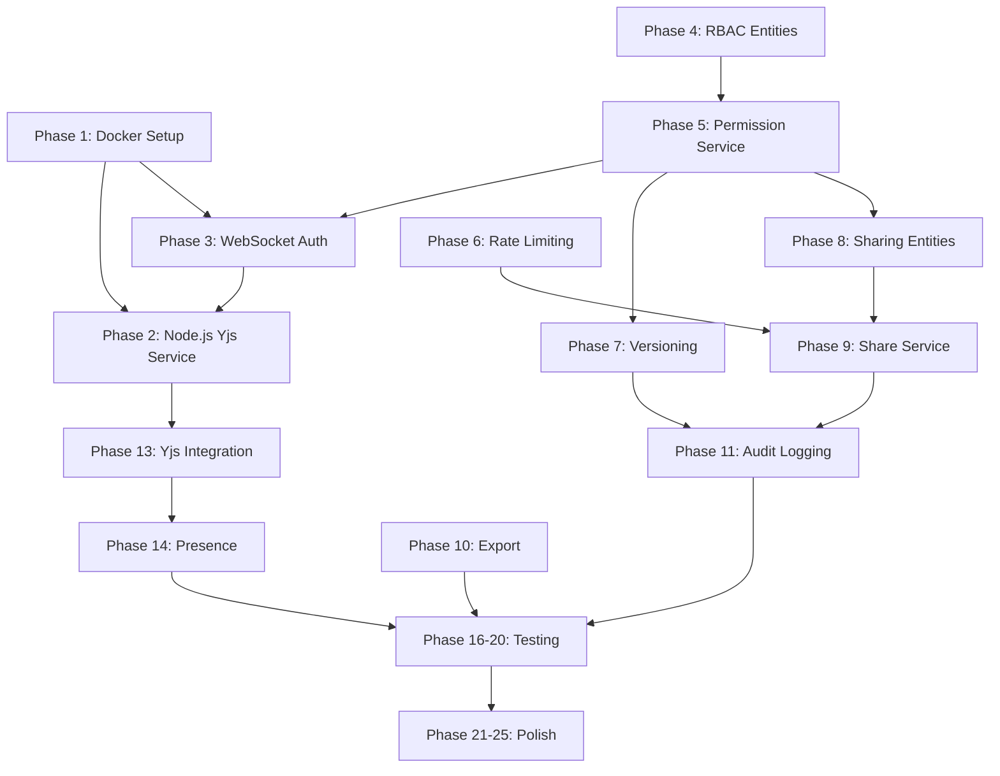

# Collab-Docs Backend - Implementation Plan

## Goal

Transform the collab-docs backend from 35% to production-ready by:
- Replacing GraalVM Yjs integration with Node.js microservice
- Fixing critical WebSocket authentication vulnerability
- Implementing RBAC and permission system
- Adding versioning, sharing, audit logging
- Dockerizing the entire stack
- Providing clean APIs for React frontend

---

## User Review Required

> [!WARNING]
> **CRITICAL ARCHITECTURAL CHANGE**
> 
> This plan **removes** GraalVM-based Yjs integration and replaces it with a Node.js microservice. This affects:
> - `YjsEngine.java`, `YjsEnginePool.java` → Will be deleted
> - `YjsCollaborationService.java` → Simplified to proxy to Node service
> - New Node.js service with Express + Yjs + Redis
> 
> **Benefits**: Simpler, battle-tested Yjs ecosystem, easier maintenance
> 
> **Trade-offs**: Adds Node.js dependency, microservice complexity

> [!IMPORTANT]
> **SECURITY FIXES**
> 
> Current WebSocket endpoint `/ws/yjs/{documentId}` has **NO authentication**. Anyone can connect to any document. This plan adds:
> - JWT validation in WebSocket handshake
> - Permission checking before connection
> - Rate limiting on connections

---

## Proposed Changes

### Phase 1: Docker Infrastructure Setup

#### [NEW] [docker-compose.yml](file:///home/lucky/collab-docs/docker-compose.yml)

Create multi-container setup:
- `postgres` - PostgreSQL 15 database
- `redis` - Redis 7 for caching/pubsub  
- `yjs-node-service` - Node.js Yjs collaboration server
- `spring-boot-app` - Main Spring Boot backend

#### [NEW] [Dockerfile](file:///home/lucky/collab-docs/Dockerfile)

Multi-stage build for Spring Boot app with optimized layers.

#### [NEW] [.dockerignore](file:///home/lucky/collab-docs/.dockerignore)

Exclude unnecessary files from Docker context.

#### [NEW] [.env.example](file:///home/lucky/collab-docs/.env.example)

Template for environment variables (DB, Redis, JWT secrets, limits).

---

### Phase 2: Node.js Yjs Microservice

#### [NEW] [yjs-service/](file:///home/lucky/collab-docs/yjs-service)

Create new directory for Node.js service containing:

- `package.json` - Dependencies (yjs, y-redis, express, ws, socket.io, jsonwebtoken)
- `server.js` - Main WebSocket server with authentication
- `yjsHandler.js` - Document state management  
- `redisAdapter.js` - Redis persistence layer
- `authMiddleware.js` - JWT validation
- `Dockerfile` - Node service container

**Key Features:**
- WebSocket server with JWT authentication
- Y.Doc management per document
- Redis persistence using y-redis
- Awareness protocol for presence
- Binary update broadcasting

---

### Phase 3: WebSocket Authentication

#### [MODIFY] [WebSocketConfig.java](file:///home/lucky/collab-docs/src/main/java/com/project/collab_docs/config/WebSocketConfig.java)

Add JWT interceptor for WebSocket handshake:
- Extract JWT from query param or header
- Validate token before connection
- Attach user info to WebSocket session

#### [NEW] [WebSocketAuthInterceptor.java](file:///home/lucky/collab-docs/src/main/java/com/project/collab_docs/security/WebSocketAuthInterceptor.java)

Interceptor to validate JWT and permissions before allowing WebSocket connection.

#### [MODIFY] [YjsWebSocketHandler.java](file:///home/lucky/collab-docs/src/main/java/com/project/collab_docs/websocket/YjsWebSocketHandler.java)

**MAJOR CHANGE**: Convert to proxy handler
- Forward authenticated connections to Node.js Yjs service
- OR: Keep handler but add authentication check in `afterConnectionEstablished`
- Check document permissions before allowing connection

---

### Phase 4: RBAC Entities & Repositories

#### [NEW] [Role.java](file:///home/lucky/collab-docs/src/main/java/com/project/collab_docs/enums/Role.java)

Enum: `OWNER`, `EDITOR`, `VIEWER`

#### [NEW] [DocumentPermission.java](file:///home/lucky/collab-docs/src/main/java/com/project/collab_docs/entities/DocumentPermission.java)

Entity mapping users to documents with roles:
```
- id: Long
- document: Document (ManyToOne)
- user: User (ManyToOne) - nullable for anonymous
- role: Role
- grantedBy: User (who granted this permission)
- grantedAt: LocalDateTime
- expiresAt: LocalDateTime (nullable)
```

Unique constraint on (document, user).

#### [NEW] [DocumentPermissionRepository.java](file:///home/lucky/collab-docs/src/main/java/com/project/collab_docs/repository/DocumentPermissionRepository.java)

Methods:
- `findByDocumentAndUser`
- `findByDocument`
- `deleteByDocumentAndUser`
- `existsByDocumentAndUser`

---

### Phase 5: Permission Service & Enforcement

#### [NEW] [PermissionService.java](file:///home/lucky/collab-docs/src/main/java/com/project/collab_docs/service/PermissionService.java)

Core permission logic:
- `hasPermission(documentId, userId, requiredRole)` - Check if user has at least this role
- `grantPermission(documentId, userId, role, grantedBy)` - Grant permission
- `revokePermission(documentId, userId)` - Revoke permission
- `getDocumentPermissions(documentId)` - List all permissions
- `getUserAccessibleDocuments(userId)` - Documents user can access

#### [NEW] [PermissionRequired.java](file:///home/lucky/collab-docs/src/main/java/com/project/collab_docs/annotation/PermissionRequired.java)

Custom annotation for permission checks: `@PermissionRequired(Role.EDITOR)`

#### [NEW] [PermissionAspect.java](file:///home/lucky/collab-docs/src/main/java/com/project/collab_docs/aspect/PermissionAspect.java)

AOP aspect to intercept `@PermissionRequired` and enforce permissions.

---

### Phase 6: Rate Limiting

#### [NEW] [RateLimitConfig.java](file:///home/lucky/collab-docs/src/main/java/com/project/collab_docs/config/RateLimitConfig.java)

Configuration for rate limits (stored in Redis):
- API calls: 100/min per user
- OTP requests: 5/hour
- Share link creation: 20/hour
- Document creation: 50/hour

#### [NEW] [RateLimitInterceptor.java](file:///home/lucky/collab-docs/src/main/java/com/project/collab_docs/security/RateLimitInterceptor.java)

Interceptor using Redis to track request counts. Returns 429 if exceeded.

---

### Phase 7: Versioning System

#### [NEW] [DocumentVersion.java](file:///home/lucky/collab-docs/src/main/java/com/project/collab_docs/entities/DocumentVersion.java)

Entity for document snapshots:
```
- id: Long
- document: Document (ManyToOne)
- versionNumber: Integer
- createdBy: User
- createdAt: LocalDateTime
- versionName: String (user-provided label)
- yjsSnapshot: byte[] (Yjs state at this point)
- contentSnapshot: String (HTML/JSON content)
- sizeBytes: Long
```

#### [NEW] [DocumentVersionRepository.java](file:///home/lucky/collab-docs/src/main/java/com/project/collab_docs/repository/DocumentVersionRepository.java)

Methods:
- `findByDocumentOrderByVersionNumberDesc`
- `findTopByDocumentOrderByVersionNumberDesc` (latest)
- `countByDocument`

#### [NEW] [VersionService.java](file:///home/lucky/collab-docs/src/main/java/com/project/collab_docs/service/VersionService.java)

Version management:
- `createVersion(documentId, versionName, userId)` - Manual checkpoint
- `listVersions(documentId)` - Get all versions with metadata
- `getVersion(versionId)` - Get specific version content
- `restoreVersion(documentId, versionId)` - Restore document to version
- `deleteVersion(versionId)` - Delete a version

#### [NEW] [VersionController.java](file:///home/lucky/collab-docs/src/main/java/com/project/collab_docs/controller/VersionController.java)

REST endpoints:
- `POST /api/documents/{id}/versions` - Create version
- `GET /api/documents/{id}/versions` - List versions
- `GET /api/versions/{versionId}` - Get version details
- `POST /api/versions/{versionId}/restore` - Restore version
- `DELETE /api/versions/{versionId}` - Delete version

---

### Phase 8: Sharing System - Entities

#### [NEW] [ShareLink.java](file:///home/lucky/collab-docs/src/main/java/com/project/collab_docs/entities/ShareLink.java)

Entity for shareable links:
```
- id: Long
- document: Document (ManyToOne)
- token: String (unique, random, 32+ chars)
- role: Role (VIEWER or EDITOR)
- createdBy: User
- createdAt: LocalDateTime
- expiresAt: LocalDateTime
- maxUses: Integer (nullable - unlimited if null)
- currentUses: Integer
- isActive: Boolean
- requiresAuth: Boolean (if true, user must login)
```

#### [NEW] [ShareInvitation.java](file:///home/lucky/collab-docs/src/main/java/com/project/collab_docs/entities/ShareInvitation.java)

Entity for email invitations:
```
- id: Long
- document: Document (ManyToOne)
- invitedEmail: String
- role: Role
- invitedBy: User
- invitedAt: LocalDateTime
- acceptedAt: LocalDateTime (nullable)
- status: InvitationStatus (PENDING, ACCEPTED, DECLINED, EXPIRED)
```

#### [NEW] [ShareLinkRepository.java](file:///home/lucky/collab-docs/src/main/java/com/project/collab_docs/repository/ShareLinkRepository.java)

#### [NEW] [ShareInvitationRepository.java](file:///home/lucky/collab-docs/src/main/java/com/project/collab_docs/repository/ShareInvitationRepository.java)

---

### Phase 9: Sharing Service (Lower Priority)

#### [NEW] [ShareService.java](file:///home/lucky/collab-docs/src/main/java/com/project/collab_docs/service/ShareService.java)

Share link and invitation management:
- `createShareLink(documentId, role, expiresInDays, maxUses)` - Generate link
- `validateShareLink(token)` - Check if link is valid
- `accessViaShareLink(token, userId)` - Grant access via link
- `revokeShareLink(linkId)` - Deactivate link
- `inviteUserByEmail(documentId, email, role)` - Send invitation
- `acceptInvitation(invitationId, userId)` - Accept invitation

**Note**: Implementation can be deferred as per user's request.

---

### Phase 10: Export APIs

#### [MODIFY] [DocumentController.java](file:///home/lucky/collab-docs/src/main/java/com/project/collab_docs/controller/DocumentController.java)

Add endpoints for exporting:
- `GET /api/documents/{id}/export/html` - Return clean HTML
- `GET /api/documents/{id}/export/json` - Return ProseMirror/TipTap JSON

**Frontend will handle PDF/DOCX generation** using libraries like:
- `jsPDF` or `pdfmake` for PDF
- `docx.js` or `html-docx-js` for DOCX

#### [NEW] [ExportService.java](file:///home/lucky/collab-docs/src/main/java/com/project/collab_docs/service/ExportService.java)

Content formatting for export:
- `getExportableHtml(documentId)` - Clean HTML (remove editor artifacts)
- `getExportableJson(documentId)` - Editor JSON format

---

### Phase 11: Audit Logging System

#### [NEW] [AuditEvent.java](file:///home/lucky/collab-docs/src/main/java/com/project/collab_docs/enums/AuditEvent.java)

Enum: `DOCUMENT_CREATED`, `DOCUMENT_VIEWED`, `DOCUMENT_EDITED`, `DOCUMENT_SHARED`, `DOCUMENT_EXPORTED`, `PERMISSION_GRANTED`, `PERMISSION_REVOKED`, `VERSION_CREATED`, `VERSION_RESTORED`

#### [NEW] [AuditLog.java](file:///home/lucky/collab-docs/src/main/java/com/project/collab_docs/entities/AuditLog.java)

Immutable audit log entry:
```
- id: Long
- event: AuditEvent
- documentId: Long (nullable)
- userId: Long (nullable)
- ipAddress: String
- userAgent: String
- timestamp: LocalDateTime
- metadata: String (JSON for additional context)
```

#### [NEW] [AuditLogRepository.java](file:///home/lucky/collab-docs/src/main/java/com/project/collab_docs/repository/AuditLogRepository.java)

Read-only repository (no delete/update operations).

#### [NEW] [AuditService.java](file:///home/lucky/collab-docs/src/main/java/com/project/collab_docs/service/AuditService.java)

Async audit logging:
- `log(event, userId, documentId, metadata)` - Queue audit entry
- `processAuditQueue()` - Scheduled task to batch insert logs

#### [NEW] [AuditAspect.java](file:///home/lucky/collab-docs/src/main/java/com/project/collab_docs/aspect/AuditAspect.java)

AOP to automatically capture audit events on annotated methods.

---

### Phase 12: Configuration Management

#### [MODIFY] [application.properties](file:///home/lucky/collab-docs/src/main/resources/application.properties)

Add configurable limits:
```properties
# Document Limits
app.document.max-size-bytes=${DOC_MAX_SIZE:10485760}
app.document.max-concurrent-users=${DOC_MAX_USERS:50}

# Rate Limiting
app.ratelimit.api-calls-per-minute=${RATE_API:100}
app.ratelimit.otp-per-hour=${RATE_OTP:5}
app.ratelimit.share-per-hour=${RATE_SHARE:20}

# Sharing
app.share.default-expiry-days=${SHARE_EXPIRY_DAYS:7}

# Yjs Node Service
app.yjs.service.url=${YJS_SERVICE_URL:http://yjs-node-service:3000}

# Versioning
app.version.max-versions-per-document=${MAX_VERSIONS:0}
```

#### [NEW] [AppConfig.java](file:///home/lucky/collab-docs/src/main/java/com/project/collab_docs/config/AppConfig.java)

`@ConfigurationProperties` class to bind these values.

---

### Phase 13: Yjs Service Integration

#### [MODIFY] [YjsCollaborationService.java](file:///home/lucky/collab-docs/src/main/java/com/project/collab_docs/service/YjsCollaborationService.java)

**Simplify to proxy layer**:
- Remove GraalVM engine pool logic
- Use `RestTemplate` or `WebClient` to call Node.js service
- Methods become HTTP calls to `http://yjs-node-service:3000/api/...`

OR **Delete entirely** if WebSocket goes directly to Node service.

#### [DELETE] [YjsEngine.java](file:///home/lucky/collab-docs/src/main/java/com/project/collab_docs/service/YjsEngine.java)

No longer needed with Node.js service.

#### [DELETE] [YjsEnginePool.java](file:///home/lucky/collab-docs/src/main/java/com/project/collab_docs/service/YjsEnginePool.java)

No longer needed with Node.js service.

#### [MODIFY] [pom.xml](file:///home/lucky/collab-docs/pom.xml)

Remove GraalVM dependencies:
- Remove `org.graalvm.js:js`
- Remove `org.graalvm.js:js-scriptengine`
- Remove `commons-pool2` (if only used for engine pool)

---

### Phase 14: Presence Awareness

Handled primarily by Node.js Yjs service (Yjs Awareness protocol).

#### [NEW] [PresenceController.java](file:///home/lucky/collab-docs/src/main/java/com/project/collab_docs/controller/PresenceController.java)

Optional REST endpoints for presence info:
- `GET /api/documents/{id}/active-users` - List active collaborators

Data sourced from Node.js service or Redis.

---

### Phase 15: Input Validation Enhancement

#### [MODIFY] All Request DTOs

Add comprehensive validation annotations:
- `@NotBlank`, `@Size`, `@Email`, `@Pattern`, `@Min`, `@Max`
- Custom validators for document size, version names, etc.

#### [NEW] [DocumentValidator.java](file:///home/lucky/collab-docs/src/main/java/com/project/collab_docs/validation/DocumentValidator.java)

Custom validator for document content size and type.

---

### Phase 16-20: Documentation & Testing

#### [MODIFY] [README.md](file:///home/lucky/collab-docs/README.md)

Comprehensive documentation:
- Architecture overview
- Setup instructions (Docker Compose)
- API documentation
- Environment variables
- Development guide

#### [NEW] Unit Tests

Service layer tests:
- `PermissionServiceTest`
- `VersionServiceTest`
- `ShareServiceTest`
- `AuditServiceTest`

#### [NEW] Integration Tests

API tests for:
- Document CRUD with permissions
- WebSocket authentication
- Version creation/restore
- Share link validation

#### [NEW] [POSTMAN_COLLECTION.json](file:///home/lucky/collab-docs/POSTMAN_COLLECTION.json)

Complete API collection for manual testing.

---

### Phase 21-25: Database Migration & Polish

#### [NEW] Migration Scripts

Since using `ddl-auto=update`, document the schema updates needed:
- `migration_v2_rbac.sql` - RBAC tables
- `migration_v2_versioning.sql` - Version tables
- `migration_v2_sharing.sql` - Share tables
- `migration_v2_audit.sql` - Audit tables

#### Performance Optimization

- Add database indexes on foreign keys
- Redis caching for permission checks
- Connection pool tuning
- Query optimization

#### Security Hardening

- HTTPS enforcement
- CORS configuration
- Security headers
- Dependency updates

---

## Verification Plan

### Automated Tests

1. **Unit Tests**
   ```bash
   cd /home/lucky/collab-docs
   ./mvnw test
   ```
   Tests to be created:
   - `PermissionServiceTest` - RBAC logic
   - `VersionServiceTest` - Version CRUD
   - `AuditServiceTest` - Audit logging
   - `RateLimitInterceptorTest` - Rate limiting

2. **Integration Tests**
   ```bash
   ./mvnw verify
   ```
   Tests to be created:
   - `DocumentControllerTest` - REST API with auth
   - `WebSocketAuthTest` - WebSocket security
   - `ShareLinkTest` - Share link validation

### Manual Testing

1. **Docker Setup**
   ```bash
   cd /home/lucky/collab-docs
   cp .env.example .env
   # Edit .env with appropriate values
   docker-compose up --build
   ```
   Verify:
   - All containers start successfully
   - Spring Boot app connects to PostgreSQL
   - Spring Boot app connects to Redis
   - Node.js Yjs service is accessible

2. **WebSocket Authentication**
   - Open browser dev tools
   - Try connecting to `ws://localhost:8080/ws/yjs/test` **without** JWT
   - Verify connection is **rejected**
   - Login via `/api/auth/login` to get JWT
   - Connect with JWT in query param: `ws://localhost:8080/ws/yjs/test?token=<JWT>`
   - Verify connection is **accepted**

3. **RBAC Testing**
   - Create document as User A (becomes OWNER)
   - Try to edit as User B (no permission) → Should be **denied**
   - Grant EDITOR permission to User B
   - Try to edit as User B → Should be **allowed**
   - Verify User B cannot delete (only OWNER can)

4. **Versioning**
   - Create document
   - Make some edits
   - Create version via POST `/api/documents/{id}/versions`
   - Make more edits
   - List versions via GET `/api/documents/{id}/versions`
   - Verify version shows old content
   - Restore old version
   - Verify document content reverted

5. **Rate Limiting**
   - Make 100+ rapid API calls
   - Verify 429 (Too Many Requests) after limit
   - Wait 1 minute
   - Verify rate limit reset

6. **Audit Logging**
   - Perform various actions (create, edit, share, export)
   - Query database: `SELECT * FROM audit_logs ORDER BY timestamp DESC LIMIT 10;`
   - Verify all actions are logged with correct event types

### Frontend Integration Testing

Work with React developer to verify:
- Authentication flow (login, JWT cookies)
- Document list API
- Real-time collaboration (WebSocket connection, updates)
- Version UI (list, restore)
- Export (download HTML/JSON, generate PDF/DOCX client-side)

---

## Dependencies Between Phases



**Critical Path**: 
P1 → P3 → P2 → P4 → P5 → P13 (Required for basic secure collaboration)

**Can be done in parallel**:
- P6 (Rate Limiting) alongside P4-P5
- P7 (Versioning) alongside P8-P9 (Sharing)
- P10 (Export) independently
